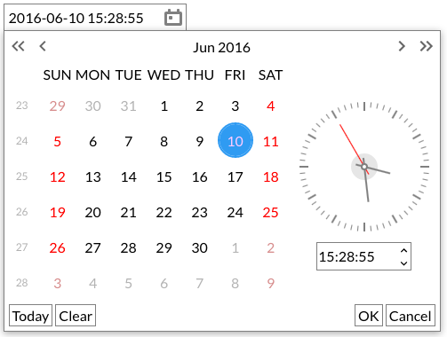
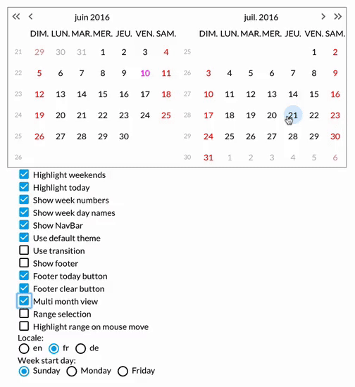

react-date-picker
=================

<!-- [](https://circleci.com/gh/zippyui/react-date-picker/tree/master) -->


> A carefully crafted date picker built especially for React, with love.

[](http://zippyui.com/docs/react-date-picker)

[](http://zippyui.com/docs/react-date-picker)

Click for [LIVE DEMO!](http://zippyui.com/docs/react-date-picker/examples)

## Install

```sh
$ npm install react-date-picker
```

## Key features

 * input field integration
 * fabulous keyboard navigation
 * single & multi views
 * easy to use but insanely configurable!
 * multiple React components that can be used standalone but compose well together
 * easily themable
 * transition on navigation
 * localization support & custom date formats
 * & [a lot more](http://zippyui.com/docs/react-date-picker/examples) ...

## Usage

Import the css first
```jsx
import 'react-date-picker/index.css'
```

Then go ahead & use the components
```jsx

import { DateField, Calendar } from 'react-date-picker'

const onChange = (dateString, { dateMoment, timestamp }) => {
  console.log(dateString)
}

let date = '2017-04-24'

<Calendar
  dateFormat="YYYY-MM-DD"
  date={date}
  onChange={onChange}
/>
```


## [Docs & examples](http://zippyui.com/docs/react-date-picker)

See [zippyui.com/docs/react-date-picker](http://zippyui.com/docs/react-date-picker)

## Components

The `react-date-picker` module exposes a number of components as named exports. The most important ones are:

 * `DateField` - a date field
 * `Calendar` - a calendar view - with support for date & time formats

The full list, besides those above:

 * `MonthView` - a calendar view without support for time.
 * `MultiMonthView` - a `MonthView` with support for multiple months. Composes `MonthView`
 * `HistoryView` - a view for selecting a year & a month from a decade. Composes `DecadeView` & `YearView`
 * `TransitionView` - a view for transitioning child views navigation
 * `YearView` - a view for month selection
 * `DecadeView` - a view for year selection
 * `ClockInput` - a Clock with an input field to pick time
 * `Clock` - a component displaying time
 * `DateFormatInput` - an input with support for editing dates & times.
 * `DateFormatSpinnerInput` - a `DateFormatInput` that also has spinner controls.
 * `Footer`
 * `NavBar`

## Changelog

See [changelog](./CHANGELOG.md)

For the old `v4` README, see [v4](./README.v4.md)

## Contributing

When contributing, please work on the `src` dir.

You'll need to run the following commands:

```sh
$ npm i # install all depedencies
$ npm run dev
# starts webpack-dev-server, which does all the bundling and live reloading
```

Now navigate to [localhost:8080](http://localhost:8080)
With this setup, you have an environment which live-reloads all your changes, so you have a rapid development cycle.

## Other

`react-date-picker` uses the awesome `moment.js` library ( Big thanks!)

## License

#### MIT
